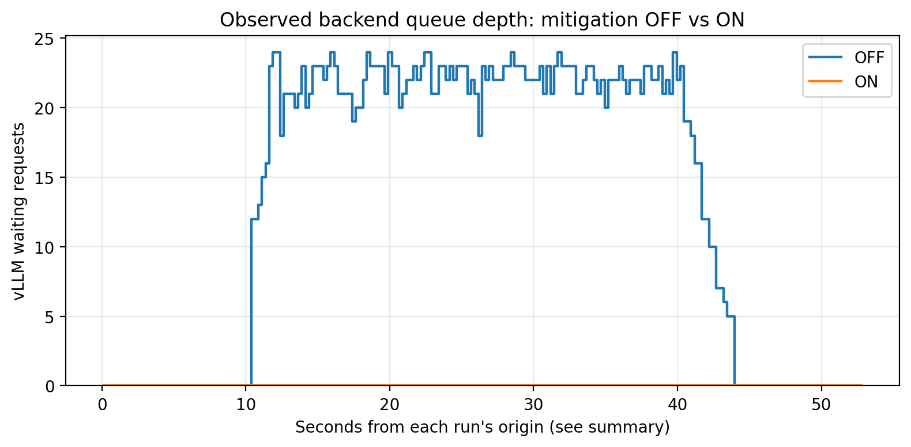

# DoS Stress-Testing & Auto-Mitigation for AI Inference Servers

An end-to-end experimental testbed for **application-layer overload of an AI inference service**. The project combines a real vLLM/Qwen backend, four Locust traffic profiles, an admission-control gateway, request and server telemetry, reproducible charts, and a submission report.

The evaluation question is not simply whether the gateway rejects traffic. It is **whether legitimate users still receive successful, low-latency inference responses while competing with abusive traffic**.

**Start here:** [Demo notebook](final_demo.ipynb) | [Traffic profiles](loadgen/locustfile.py) | [Recorded results](results/) | [Submission deck](report/slides.pdf) | [Deck sources](report/)

> **Evidence status:** the repository contains an encouraging small-sample smoke test and a newer, more demanding Locust flood comparison. The newer run bounded the backend queue but rejected most legitimate requests. These are different experiments, not interchangeable results. See [Recorded results](#recorded-results) and [Known issues](#known-issues-and-pending-fixes).

## Architecture

```text
Locust load generator
  |-- legitimate clients
  `-- attack clients: spike / flood / low-and-slow
          |
          v
Admission gateway, same hop in OFF and ON runs
  |-- per-client request-rate and token-cost budgets
  |-- per-client concurrency limit
  |-- global in-flight slots and bounded admission wait
  |-- cost-based reserved slots and pressure/fair-share checks
  `-- optional VAE-based adaptive tightening
          |
          v
Real vLLM inference server -> Qwen/Qwen2.5-0.5B-Instruct -> GPU
          |
          v
Client JSONL + gateway decisions + sampled backend state
          |
          v
CSV summaries, PNG charts, evidence ZIP, report
```

The recorded GPU experiments use a **single Colab Tesla T4, one vLLM instance, and an eight-sequence scheduler limit**. There is no autoscaling. This is a deliberately capacity-constrained testbed, not a claim about the GPU's maximum achievable throughput.

The final notebook uses backend `127.0.0.1:8000` and gateway `127.0.0.1:8090`. The gateway CLI defaults to port `8080`; older debugging runs used other ports. Actual addresses are recorded in each run's metadata. Port changes are deployment details, not mitigation mechanisms.

## Mapping to the competition requirements

| Requirement | Implementation | Evidence and qualification |
|---|---|---|
| Real inference service with realistic per-request cost | vLLM serving Qwen; prompt length and requested output length vary | Original notebooks and saved real-backend metadata; the CPU stand-in is for tests only |
| Metrics endpoint: latency, queue depth, success | vLLM `/metrics`, gateway `/metrics`, client outcomes | Raw request logs and `gateway_samples.jsonl`; success is assessed at the client, not inferred from queue size |
| Normal, spike, sustained flood, low-and-slow traffic | Four profiles in `loadgen/locustfile.py` | All four are implemented; the bundled newer paired raw runs cover **flood**, not the entire eight-condition matrix |
| At least two mitigation mechanisms | Per-client budgets plus bounded global admission/fast rejection | `gateway/ratelimit.py`, `gateway/admission.py`, `gateway/slots.py` and mode configs |
| Before/after p50, p95, errors, legitimate-user availability | Notebook B6 joins attempts to outcomes and compares OFF/ON | `results/live_before_after.csv`; the newer ON run does **not** meet the legitimate-availability objective |
| Charts generated from actual runs | Notebook analysis and queue plotting; report figure generator | PNGs, underlying CSV/JSONL, and provenance retained; historical console transcriptions are distinguished from raw-log recomputation |

## Repository guide

```text
final_demo.ipynb          Main demonstration, live runner, analysis and export
integration.ipynb         Original integration/debugging and smoke-test record
testing.ipynb             Original backend/concurrency probe
loadgen/locustfile.py     Four Locust profiles and per-request client logs
demo/runtime.py          Supporting process and experiment helper code
demo/queue_chart.py      Queue-chart function, using real sampled state
gateway/                 Admission, limiting, proxying, telemetry and VAE code
configs/                 OFF, rate-limit, combined, and optional VAE configs
scripts/smoke_load.py     Short gateway integration probe, not all four profiles
scripts/queue_depth_chart.py  Standalone plot launcher for the older run IDs
tests/                   CPU unit/integration tests against a stand-in
results/                 Historical and newer results, PNGs and evidence archive
report/                  HTML/PDF report, source data and figure/build scripts
```

The notebook contains its own copies of the runtime/plotting helpers; B4 writes the Locust file. Editing a supporting `.py` copy alone does not change the corresponding notebook cell. Keep those copies aligned when changing the demo.

## View the existing evidence without a GPU

Open the CSVs and PNGs in [`results/`](results/), or open [`final_demo.ipynb`](final_demo.ipynb) in Colab with `RUN_LIVE_DEMO = False`.

A1 locates/clones the project, A2 displays the historical smoke comparison, and A3 defines the queue-plot function. **A4 defaults to the older `flood-off-8` and `flood-on-fresh` run folders.** Those historical raw folders are not included in the evidence archive. The newer raw flood pair is included, under different run IDs.

To regenerate the **newer** queue chart, run the following from the repository root after installing `pandas` and `matplotlib`. Extraction goes into a separate folder so existing run directories and saved results are not overwritten:

```python
from pathlib import Path
from zipfile import ZipFile
import json
from demo.queue_chart import plot_queue_depth

root = Path.cwd()
recovered = root / "recovered_evidence"
with ZipFile(root / "results/demo_evidence.zip") as archive:
    for member in archive.infolist():
        target = (recovered / member.filename).resolve()
        if not target.is_relative_to(recovered.resolve()):
            raise ValueError("Unsafe archive path")
    archive.extractall(recovered)

saved = json.loads((root / "results/latest_demo_runs.json").read_text())["flood"]
paths = {
    mode: recovered / "runs" / Path(old_path).name / "gateway_samples.jsonl"
    for mode, old_path in saved.items()
}
plot_queue_depth(paths, root / "results/recomputed")
```

Missing or stale backend readings are not treated as zero. Queue plots require actual samples; a maximum queue value alone cannot reconstruct a time series.

## Run the live Colab demo

Open [the notebook in Colab](https://colab.research.google.com/github/mena-04/DoS-Stress-Testing/blob/main/final_demo.ipynb). Live replay needs a suitable GPU runtime; viewing saved results does not.

In A1 select:

```python
RUN_LIVE_DEMO = True
PROFILES = ["flood"]
# To run the complete profile/mode matrix instead:
# PROFILES = ["normal", "spike", "flood", "low_slow"]
```

Run A1-A3, then B1-B7 in order, followed by C. A4 is optional and is only for old raw logs. B1 installs live-run dependencies when enabled, B3 starts or verifies **real vLLM**, B5 runs the selected OFF/ON pairs, B6 summarizes client outcomes, B7 plots the selected pair's queue, and C packages the evidence.

The notebook uses the installation/version recorded in the earlier successful environment, checks process readiness and forwarding, uses unique run IDs, and stops each managed gateway before the next mode. It does not start a fake backend as a substitute for a live GPU experiment.

**Before treating a rerun as a validation:** review the open issues below. Notebook execution alone does not mean the mitigation preserved legitimate service.

### Local setup and individual components

From the repository root:

```bash
python -m pip install -e ".[dev,report]" locust pandas requests
```

This installs the gateway/test/report dependencies and the separately required load/analysis tools. It does **not** install vLLM or a model. Use the notebook's recorded GPU setup or an already working, compatible vLLM environment.

The backend launch configuration used by the demo is:

```bash
vllm serve Qwen/Qwen2.5-0.5B-Instruct \
  --dtype half --max-model-len 2048 \
  --gpu-memory-utilization 0.85 --max-num-seqs 8 \
  --host 127.0.0.1 --port 8000
```

For a manually managed gateway, run **one mode at a time**, in its own terminal or a background subprocess in Colab:

```bash
python -u -m gateway --config configs/off.yaml \
  --upstream http://127.0.0.1:8000 --port 8090 --run-id manual-flood-off

# Stop that gateway, then start ON with a different run ID:
python -u -m gateway --config configs/ratelimit_queue.yaml \
  --upstream http://127.0.0.1:8000 --port 8090 --run-id manual-flood-on
```

Check both health endpoints and a real `POST /v1/chat/completions` through the gateway before starting load. A healthy proxy does not prove its upstream is reachable.

## Traffic profiles

Each profile keeps four legitimate virtual users making small requests with a 32-token output limit. Attacker users send medium prompts with a 128-token limit for spike/flood, and long prompts with a 256-token limit for low-and-slow.

| Profile | Timeline | Total virtual users during attack | Attacker wait after each response |
|---|---|---:|---|
| `normal` | 30 seconds, legitimate traffic only | 4; no attackers | Not applicable |
| `spike` | 10 s baseline, 10 s attack, 10 s recovery | 24: 4 legitimate + 20 attackers | 0.05-0.15 s |
| `flood` | 10 s baseline, 30 s attack, 10 s recovery | 32: 4 legitimate + 28 attackers | 0.05-0.15 s |
| `low_slow` | 10 s baseline, 30 s expensive-request phase, 10 s recovery | 8: 4 legitimate + 4 attackers | 1.5-2.5 s |

This is a **closed-loop Locust workload**: each virtual user waits for a response before its next task. Identical user schedules and seeds therefore do not guarantee identical arrival timestamps or request counts. Fast rejection can increase attempted requests per second. Record actual load and do not describe the test as fixed-RPS replay.

Example, with the OFF gateway above already running:

```bash
mkdir -p runs/manual-flood-off
DOS_PROFILE=flood DOS_RUN_ID=manual-flood-off \
DOS_RUN_DIR=runs/manual-flood-off DOS_SEED=42 \
python -m locust -f loadgen/locustfile.py --headless \
  --host http://127.0.0.1:8090 \
  --csv runs/manual-flood-off/locust --csv-full-history --stop-timeout 125
```

Repeat with the ON gateway and a new matching run ID/directory. `DemoShape` controls duration and user counts, so do not add a conflicting `--users` or `--run-time`. Locust can exit nonzero for expected HTTP rejections; inspect the recorded status/reason breakdown rather than equating all failures with a generator crash.

The generator sends `X-Client-ID`, unique `X-Request-ID`, and analysis-only `X-Traffic-Label`. There are no application-level retries. Prompts have a deterministic per-user/request prefix; the notebook does **not** disable vLLM prefix caching. Cache behavior and actual output length remain part of the recorded workload.

## Mitigation modes and configuration

| Config | Behavior |
|---|---|
| `configs/off.yaml` | Passthrough through the same gateway, with logging/sampling |
| `configs/ratelimit.yaml` | Request-rate bucket, token-cost bucket and per-client concurrency limit |
| `configs/ratelimit_queue.yaml` | Those limits plus global admission, bounded wait, cost-partitioned slots and pressure/fair-share checks |
| `configs/full.yaml` | Adds optional VAE-adaptive tightening when a compatible trained model loads |

The first mechanism limits individual clients. The second limits admitted in-flight work and returns `503` when a slot cannot be obtained within the configured wait. The wait is time-bounded; this is not a separate hard cap on the number of HTTP requests waiting at the gateway.

`429` denotes client-specific limiting; `503` denotes admission shedding. A legitimate request rejected by either is still an unsuccessful legitimate request. The traffic label is logged but is not an input to the admission decision. Identity headers are a laboratory convention, not authenticated identities.

The shipped combined config now has:

```yaml
backpressure:
  global_max_inflight: 8
  upstream_max_num_seqs: 8
  reserved_cheap_slots: 2
```

`configs/full.yaml` now carries the same three values, so it differs from `configs/ratelimit_queue.yaml` only by its anomaly block; previously it specified 32/32/8, which meant the VAE arm of the ablation also changed capacity. Other thresholds still need calibration. The notebook creates `configs/demo_off.yaml` and `configs/demo_on.yaml` copies with the eight-slot values; it preserves the other thresholds. See the known-issues section before reusing these settings for another workload.

## Logs, metrics and charts

Each new notebook run writes `runs/<unique-run-id>/`:

| File | What it records |
|---|---|
| `client_attempts.jsonl` | Request starts, IDs, client labels and traffic phase |
| `client_requests.jsonl` | Client-observed latency, actual HTTP status, completion validity, token usage and rejection reason |
| `gateway.jsonl` | Per-request decision, estimated cost, admitted slots and latency |
| `gateway_samples.jsonl` | Timestamped gateway/backend state, sampled every 250 ms, including upstream staleness |
| `gateway_config.json` | Resolved gateway config, tokenization method and whether VAE scoring is active |
| `load_profile.json`, `demo_manifest.json` | Profile timing, seed, backend identity and run parameters |
| `locust_*.csv`, process logs | Aggregate/history statistics, failures and diagnostics |

Join client and gateway request records by `request_id`. Align state samples by **timestamps**, not request ID. Sampling already runs inside the gateway in both modes; another polling thread is unnecessary.

The backend exposes running/waiting gauges, latency/queue-time distributions and completion/token counters. The gateway exposes admission/rejection/latency metrics. Headline results come from client attempts and valid completions: engine counters alone do not identify legitimate users or client timeouts.

B6 calculates successful-request p50/p95 and reports success, failure, rejection, transport errors and unfinished requests alongside them. For attack profiles it selects requests **started during the attack window**; for normal it selects the normal window. These are not necessarily the same aggregates as Locust's whole-run CSV.

The notebook saves `live_before_after.csv`, `live_legitimate_p95.png`, `queue_depth_off_vs_on.png`, `queue_depth_samples.csv` and `queue_depth_summary.csv`. Section C bundles selected raw run folders and outputs into `results/demo_evidence.zip`. `runs/` is Git-ignored, so committing the notebook alone does not preserve raw evidence.

## Recorded results

### Newer raw-log flood comparison

Source: [`results/live_before_after.csv`](results/live_before_after.csv), backed by the two raw run folders in [`results/demo_evidence.zip`](results/demo_evidence.zip), pair `demo-20260911-180828-5190b1`. Both use real vLLM according to the saved manifests. The table uses the 10-40 second attack-start window; queue maxima use the fresh sampled series after load start.

| Metric | OFF | ON |
|---|---:|---:|
| Legitimate attempts during attack | 33 | 96 |
| Successful legitimate completions | 33 | 8 |
| Legitimate success rate | 100.00% | 8.33% |
| Legitimate failure/rejection rate | 0.00% | 91.67% |
| Successful legitimate p50 | 2.810 s | 0.473 s |
| Successful legitimate p95 | 2.986 s | 0.630 s |
| Attacker rejection rate | 0.00% | 88.90% |
| Maximum fresh observed backend queue | 24 | 0 |

**Interpretation:** the ON configuration prevented a backend queue, but it did not preserve legitimate availability. Its lower p95 describes only eight successful legitimate responses. All 88 failed legitimate requests in the attack window were `503` / `queue_timeout`, not fair-share `queue_pressure` rejections.

The logs also show why the reserved lane needs recalibration: legitimate estimated costs were 48-49 and attacker costs 320-322, while `cheap_cost_threshold` was 512. Both groups qualified as cheap, and attackers used reserved slots. This is separate from the long-running-cost bug described below; fixing that bug alone does not establish that this run will pass.



### Earlier small smoke test

Source: [`integration.ipynb`](integration.ipynb), [`results/flood_before_after.csv`](results/flood_before_after.csv), and the manually transcribed provenance in [`report/data/t4_runs.json`](report/data/t4_runs.json).

That earlier one-attacker-identity test recorded legitimate p95 of **9.546 s OFF versus 1.323 s ON**, with 100% legitimate success in both arms and 50% attacker rejection ON. It contained only **3 legitimate requests OFF and 15 ON**. Its p95 is a small-sample demonstration, not a stable service-level estimate, and the earlier raw queue files are not bundled.

Do not combine this smoke-test latency result with the newer Locust queue chart as though they came from the same experiment. The report's current figures use the older smoke data; the newer results must be acknowledged when updating the report.

## Optional VAE layer

`gateway/anomaly/` implements a NumPy VAE with a 12-feature input, a default hidden width of 32 and latent width of 4. Training uses latent sampling and KL regularization; serving reconstructs from the latent mean and turns standardized reconstruction error into a cached anomaly score. Tiers tighten existing client limits rather than replacing the hard controls.

Training input must contain **normal-only** traffic with feature logging enabled. The loader does not filter attack labels for you.

```bash
mkdir -p models
python -m gateway.anomaly.train runs/normal-1/gateway.jsonl -o models/vae.npz
```

Use the printed held-out score distribution to choose thresholds, and align `configs/full.yaml` to the actual backend before running it. A missing or incompatible model leaves anomaly scoring inactive while the configured static defenses remain. Check `anomaly_active` in `/gateway/state` or `gateway_config.json`.

The bundled newer OFF/ON experiment has `anomaly_active: false` in both arms. It is not a VAE evaluation, and the repository does not establish a measured VAE advantage over the rules-only gateway.

## Known issues and pending fixes

The following status describes the reviewed `main` snapshot **`c81dce1`** and the uploaded repository. Writing this README does not merge code fixes.

| Issue | Status at review |
|---|---|
| Long-running requests lose fair-share cost after the 10 s window | **Unresolved on main.** [PR #4](https://github.com/mena-04/DoS-Stress-Testing/pull/4) implements `expired_open_cost` and a regression test, but was still open/unmerged |
| Main combined config uses eight backend/gateway slots and two reserved slots | **Applied** in `configs/ratelimit_queue.yaml`, and now in `configs/full.yaml` too, so the VAE arm no longer changes capacity as well as the anomaly layer |
| Reserved lane admitted this flood's attackers | **Still open, and now the headline result.** `cheap_cost_threshold` 512 against legitimate cost 48-49 and attacker cost 320-322 meant both classes counted as cheap; 88 of 96 legitimate requests in the attack window got `503 queue_timeout` |
| `upstream_waiting_high: 24` / low `8` | **Still present.** Usually inactive with an eight-slot gateway in front of an eight-sequence backend; use measured local occupancy and validate thresholds |
| Completion-latency EWMA recovery | **Unresolved.** Defaults remain 20,000/8,000 ms, with no time-based idle decay; long allowed generations can keep pressure elevated |
| Reserved-lane threshold for the current Locust flood | **Needs calibration.** The saved 512 threshold also admits this workload's attackers into the cheap lane |
| CLI log-directory preflight and flushed startup banner | **Not on main.** [PR #3](https://github.com/mena-04/DoS-Stress-Testing/pull/3) contains the changes and was still an unmerged draft; notebook subprocesses already use unbuffered Python |

The fair-share bug was reproduced during review: at t=11 s, eight still-running attacker requests had zero accounted cost, while a new 43-cost legitimate request was assigned the entire share and marked for shedding. The checked-in suite passed **74 tests** but did not contain PR #4's new regression. Do not claim 75 passing tests for this snapshot.

For a corrected experiment, incorporate and test the fixes, calibrate cost separation using measured normal/attack distributions, then rerun paired conditions with new run IDs. Do not relabel old data as results of the corrected code.

Other limitations: per-client IDs can be rotated; the reserved lane protects qualifying cheap work rather than knowing who is legitimate; cost is an estimate based on requested generation length; prefix-cache and batching effects matter; the current evidence contains one raw paired profile and no repeated-run uncertainty estimates. The prototype is not an Internet-hardened production gateway.

### Recommended order for future review

Not done yet; listed here so the next pass has a fixed sequence instead of picking issues ad hoc:

1. Review and, if accepted, merge [PR #4](https://github.com/mena-04/DoS-Stress-Testing/pull/4) (fair-share/`expired_open_cost` fix), then run its regression test plus the full suite. Preserve `FEATURE_NAMES` as-is — no VAE feature-layout change is required by this fix.
2. Calibrate `cheap_cost_threshold` and the reserved-slot split against the actual Locust payload costs (legitimate ~48-49, attacker ~320-322 in the current flood), and align `configs/full.yaml` to the eight-slot backend used by `configs/ratelimit_queue.yaml`. Treat `upstream_waiting_high/low` and the latency-EWMA recovery bounds as a separate calibration pass against the real workload, not a copy of the current defaults.
3. Review and, if accepted, merge [PR #3](https://github.com/mena-04/DoS-Stress-Testing/pull/3) (writable-log-directory preflight, flushed startup banners), using general startup-error wording rather than a fixed two-cause explanation.
4. Rerun the flood profile OFF/ON with new run IDs once 1-2 land, on the same real backend/settings, and check legitimate completion rate before quoting p95 — a low p95 over a handful of successes is not availability.
5. Update the submission deck from that new run. **Done for the current snapshot:** the long-form `report/report.html` and `report.pdf` have been removed rather than maintained in parallel, and `report/slides.pdf` now reports the newer raw-log flood pair as its primary result, states 74 tests, and marks the fair-share fix as diagnosed but unmerged. Its data lives in `report/data/locust_flood.json`, transcribed from the raw logs. Rebuild it with `bash report/build.sh` after any rerun.

## Troubleshooting and tests

`/health` on the gateway is process health, not end-to-end inference health. A refused connection means the target listener is unavailable; a gateway `502` means forwarding failed; `429`/`503` are only expected mitigation outcomes when their reason and client class support that interpretation.

Uvicorn's `STARTUP_FAILURE` code is 3. It does **not**, by itself, mean the upstream model is down or identify one unique root cause. Read the startup traceback. Log-path/lifespan errors and address conflicts must be diagnosed separately; a bind error can also exit with code 1. Use `python -u` or `PYTHONUNBUFFERED=1` for ordered redirected output, unique log files and bounded process waits. Stop the managed gateway rather than accumulating copies on new ports.

Real-socket probes run during review, on the unchanged gateway:

| Scenario | Observed result |
|---|---|
| Upstream address has no server | Gateway starts; `/health` returns 200; an inference call returns `502` |
| Gateway port already occupied | Exit code 1, explicit address-in-use message |
| Logging directory unwritable | Exit code 3, with a lifespan/log-directory traceback |

So an unreachable upstream is not by itself a gateway startup failure, and a busy port does not necessarily produce exit code 3 in the tested Uvicorn version — always read the actual traceback rather than assuming from the exit code alone.

Run CPU tests with:

```bash
python -m pytest tests/ -q
```

`gateway.fake_vllm` is a simulation for integration tests: it sleeps according to a cost model, implements sequence slots and metrics, and does not run a neural model. Passing its tests is not a substitute for successful real-GPU before/after evidence.

**Resolved:** the submission document no longer disagrees with this README. `report/report.html` and `report/report.pdf` are gone, and `report/slides.pdf` states 74 passing tests, marks the fair-share repair as diagnosed but unmerged, and uses the newer raw-log flood pair from [Recorded results](#recorded-results) as its primary result with the historical smoke pair labelled as a small-sample secondary. The fair-share fix itself is still unmerged — see [Known issues](#known-issues-and-pending-fixes).

Submit the demo notebook, source code/configs, generated charts and summaries, and the raw evidence archive. Keep historical and corrected runs distinct. Run load tests only against infrastructure you own or are explicitly authorized to test; the supplied Locust demo restricts its target to loopback.
